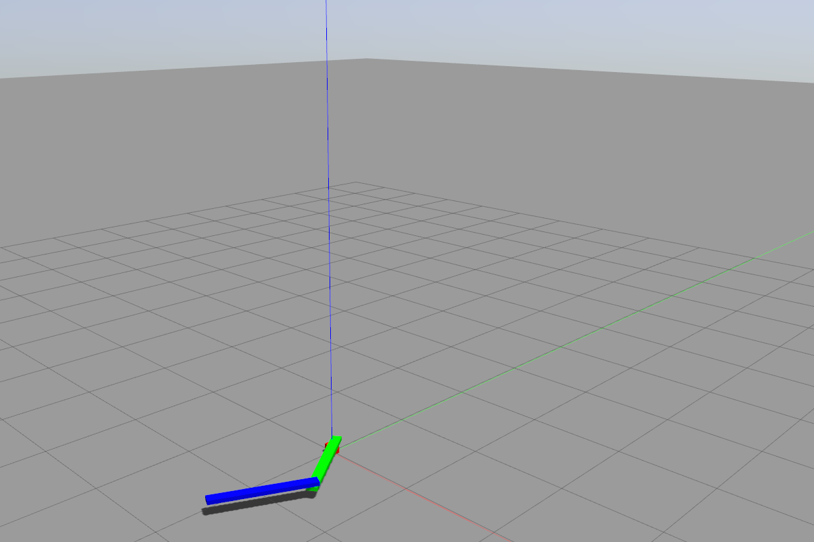

# Technical_assignment_TUD_internship
This repository consists of the ROS1 & ROS2 packages developed for simulating & controlling a 2DOF serial manipulator.Three different exercises of the technical assignment for the TUD internship is solved and the ROS2 package is the solution for the programming part.

The robotic arm consits of two revolute joints and two rigid segments. Each link has a total mass of 1kg with uniform mass distribution and is of length 1m. The two segments are connected to each other with a rotational or revolute joint which can also be actuated
(e.g., we can apply a torque to the rotational joint). We connect the two segments with an additional rotational and actuated joint to the ground plane. Gravity is acting in vertical
direction - so rectangular to the ground plane.

The inverse as well as forward kinematics of this manipulator has been studied and an analytical approach is used to implement inverse kinematics in 'ex3.py' python script.

Both soft joints & normal joints has been modeled in their respective xacro/urdf files.



> As of now, there are two packages for same task, one build on ROS1 Melodic tested with Ubuntu 18.04 in local system and another on ROS2 Foxy in a docker container where VNC server was used for Gazebo gui.

## Installation
This model depends on the following packages:
- Gazebo ROS Packages
- ROS control
- ROS controllers
### For ROS1
```bash
$ sudo apt install ros-melodic-gazebo-ros-pkgs
$ sudo apt install ros-melodic-gazebo-ros-control
$ sudo apt install ros-melodic-ros-control* ros-melodic-control*
$ sudo apt install ros-melodic-moveit
```
### For ROS2
```bash
$ sudo apt install ros-foxy-gazebo-ros-pkgs
$ sudo apt install ros-foxy-ros-core ros-foxy-geometry2
$ sudo apt install ros-foxy-realtime-tools ros-foxy-xacro ros-foxy-angles
$ sudo apt install ros-foxy-gazebo-ros2-control
$ sudo apt install ros-foxy-ros2-control 
$ sudo apt install ros-foxy-ros2-controllers

https://moveit.ros.org/install-moveit2/source/
```
## Usage

- Build catkin workspace, either through catkin build or colcon build for ROS1 & ROS2 respectively
- Source the setup.bash file that you want to use ROS in

### Note:

#### Error encountered while working with ROS2 nodes in docker container:

- Start at Line 44 in /opt/ros/foxy/lib/python3.8/site-packages/ros2controlcli/verb/load_controller.py

- **args.state** replace it with **args.set_state** in each line

- Error may vary from user to user as when I checked the code base on github, the correct argument was
accessed.